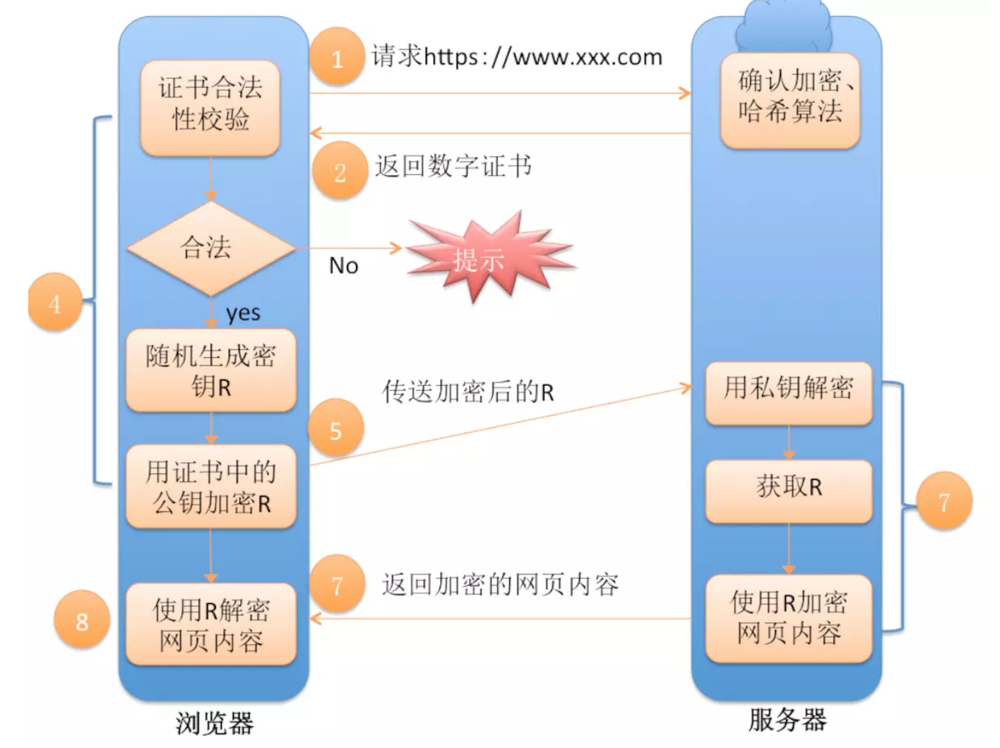

# HTTPS请求
- HTTPS协议即安全的超文本传输协议，在HTTP上面提供一个传输层的安全层

> 参考链接： https://www.jianshu.com/p/ecbae815baf2

处理过程如图：

整体过程分一下几个部分：

1. 浏览器发起往服务器的 443 端口发起请求，请求携带了浏览器支持的加密算法和哈希算法。
2. 服务器收到请求，选择浏览器支持的加密算法和哈希算法。
3. 服务器下将数字证书返回给浏览器，这里的数字证书可以是向某个可靠机构申请的，也可以是自制的。
    （注释：证书包括以下这些内容：1. 证书序列号。2. 证书过期时间。3. 站点组织名。4. 站点DNS主机名。
    5. 站点公钥。6. 证书颁发者名。7. 证书签名。因为证书就是要给大家用的，所以不需要加密传输）
4. 浏览器进入数字证书认证环节，这一部分是浏览器内置的 TSL 完成的：
    1） 首先浏览器会从内置的证书列表中索引，找到服务器下发证书对应的机构，如果没有找到，此时就会提示用户该证书是不是由权威机构颁发，是不可信任的。如果查到了对应的机构，则取出该机构颁发的公钥。
    2） 用机构的证书公钥解密得到证书的内容和证书签名，内容包括网站的网址、网站的公钥、证书的有效期等。浏览器会先验证证书签名的合法性（验证过程类似上面 Bob 和 Susan 的通信）。签名通过后，浏览器验证证书记录的网址是否和当前网址是一致的，不一致会提示用户。如果网址一致会检查证书有效期，证书过期了也会提示用户。这些都通过认证时，浏览器就可以安全使用证书中的网站公钥了。
    3） 浏览器生成一个随机数 R，并使用网站公钥对 R 进行加密。
5. 浏览器将加密的 R 传送给服务器。
6. 服务器用自己的私钥解密得到 R。
7. 服务器以 R 为密钥使用了对称加密算法加密网页内容并传输给浏览器。
8. 浏览器以 R 为密钥使用之前约定好的解密算法获取网页内容。

注释：

第3步中，证书的内容包含的证书的签名是什么？

签名是指利用上一层证书的私钥，加密一些元信息（证书所有者的信息，包括基本信息，公钥，证书生效域名等）。这样，当收到签名证书时，只需要根据CA提供的公钥对签名解密，验证元信息是否一致，就可以判断当前证书是否合法。一句话来说就是，每个证书会对下一层的证书合法性做担保 。

第4步中，怎么认证数字证书？

客户端怎么确认你的证书是合法的呢。首先你的证书会在https握手过程中被传递到浏览器，浏览器从你的证书中找到了颁发者，从颁发者的证书（如果你电脑上有的话）又找到了CA的证书（CA证书会在操作系统安装时就安装好，所以每个人电脑上都有根证书），使用CA证书中带的公钥来对颁发者证书做验签，一旦匹配，说明你电脑上的颁发者证书不是伪造的，同理，再用颁发者证书中的公钥去验证你的证书，以此证明你的证书不是伪造的。这样整个链状的验证，从而确保你的证书一定是直接或间接从CA签发的，这样浏览器地址栏会显示一个绿色的盾牌，表示你的网站能通过证书验证
如果你的电脑上没有颁发者证书（断链）或者你自己本身就是自签名证书（自己做CA，但是要记得，人家电脑上并没有装你的自签名根证书），那么浏览器会报警提示不能验证证书，问你是否还需要继续。

