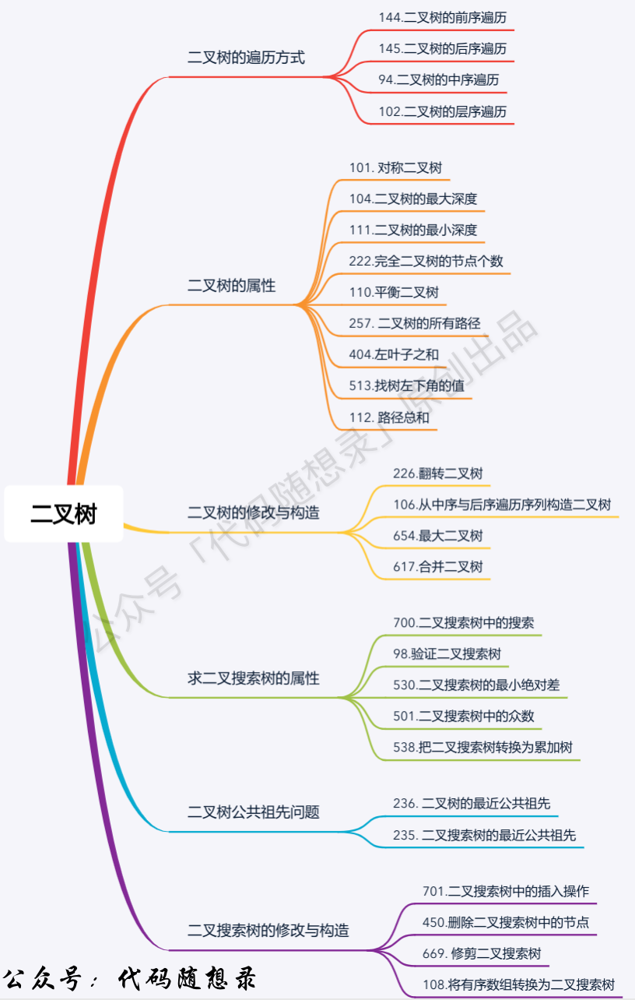

插件二叉树的题型

### 满二叉树

如果一颗二叉树只有度为0的节点和度为2的节点，并且度为0的节点在同一层上，则这颗二叉树为满二叉树

深度为k, 2^k - 1个节点

### 完全二叉树

在完全二叉树中，除了最底层节点可能没有填满外，其余每层节点数都达到了最大值，并且最下面一层的节点都集中在该层最左边的若干位置。若最底层为第h层，则该层包含 1~2^h - 1个节点

> 之前我们讲过优先队列其实是一个堆，堆就是一个完全二叉树，同时保证父子节点的顺序关系

### 二叉搜索树

二叉搜索树是有数值的，二叉搜索树是一个有序树

- 若它的左子树不空，则左子树上所有节点的值均小于它的根节点的值
- 若它的右子树不空，则右子树上所有节点的值均大于它的根节点的值
- 它的左右子树也分别是二叉排序树

### 平衡二叉搜索树

平衡二叉搜索树：又称 AVL树，它是一个空树，或者它的左右两个子树的高度差绝对值不超过 1，并且左右两个子树都是一个平衡二叉树。

## 二叉树的存储方式

二叉树可以链式存储，也可以顺序存储

链式存储就用指针，顺序存储的方式就是用数组

用数组来存储二叉树如何遍历：

如果父节点的数组下标是i , 那么它的左孩子就是 i * 2 + 1 ， 右孩子就是 i * 2 + 2

### 二叉树的遍历方式

二叉树主要有两种遍历方式

1. 深度优先遍历：先往深走，遇到叶子节点再往回走
2. 广度优先遍历：一层一层的去遍历

这两种遍历是图论中最基本的两种遍历方式

- 深度优先遍历
  - 前序遍历（递归法，迭代法）（中左右）
  - 中序遍历（递归法，迭代法）（左中右）
  - 后序遍历（递归法，迭代法）（左右中）
- 广度优先遍历
  - 层次遍历（迭代法）

