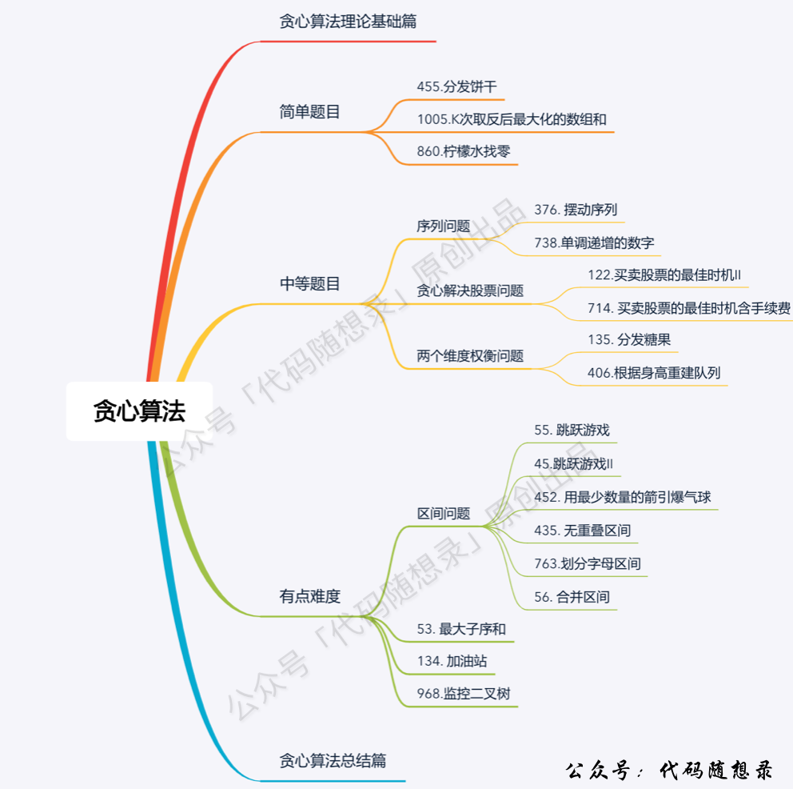

#### 什么是贪心

贪心的本质是选择每一阶段的局部最优，从而达到全局最优

#### 贪心的套路（什么时候用贪心）

说实话，贪心算法没有固定的套路。

> 如何验证可不可以用贪心算法呢

最好用的策略就是举反例，如果想不到反例，那么就试试贪心算法

**刷题或者面试的时候，手动模拟一下，感觉可以局部最优推出整体最优，而且想不到反例，那么就试试贪心**

#### 贪心算法一般解题步骤

- 将问题分解为若干个子问题
- 找出适合的贪心策略
- 求解每一个子问题的最优解
- 将局部最优解堆叠成全局最优解

